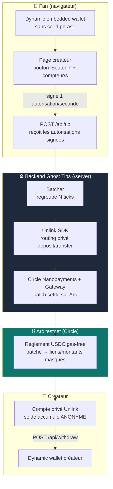

# Ghost Tips

**Soutiens qui tu veux, à la seconde — sans que personne sache que c'est toi.**

Ghost Tips permet de soutenir un créateur ou un activiste avec des **nanopaiements à la seconde** en USDC, tout en gardant le lien fan→créateur, les montants et les soldes **totalement privés**. Le créateur voit un total anonyme qu'il peut retirer ; sur la blockchain, personne ne peut reconstruire qui soutient qui.

> ETHGlobal New York 2026 · Track : **Best Private Nano Payment App** (Dynamic + Unlink + Arc)

---

## Pourquoi

Le « pay-per-second creator economy » existe déjà (il a même gagné HackMoney 2026) — **mais sans confidentialité**. Or soutenir un journaliste sous pression, un activiste, ou un créateur de niche stigmatisée peut être **dangereux** si la transaction est publique. Le vrai actif sensible n'est pas le montant : c'est le **graphe « qui soutient qui »**. Ghost Tips le cache.

---

## Architecture



---

## Rôle de chaque SDK (exigé par le track)

| Outil | Rôle dans Ghost Tips |
|-------|----------------------|
| **Dynamic** | Création de wallets embarqués **sans seed phrase** (fan & créateur) + signature des autorisations de tip à la seconde |
| **Unlink** | Comptes privés + **routing privé** des transferts (`deposit` / `transfer` / `withdraw`) → masque le lien fan→créateur, les montants et les soldes |
| **Arc (Circle)** | Règlement **gas-free, sub-cent, haute fréquence** des nanopaiements via Circle Nanopayments + Gateway, en USDC |

---

## 🔒 Ce qui reste privé (et pourquoi)

C'est le cœur du prix — voici précisément ce que Ghost Tips cache :

- **Le lien fan → créateur** (qui soutient qui). Les transferts sont routés via **Unlink**, donc le compte source du fan n'est pas reliable au créateur on-chain.
- **Le montant de chaque tip** et le **solde** du fan comme du créateur — confidentiels via les comptes privés Unlink.
- **La fréquence/temporalité** réelle des tips : le **batcher** + le règlement groupé Circle Nanopayments agrègent N ticks en un règlement, cassant la corrélation temporelle.

**Ce qui reste public / vérifiable :** qu'un règlement USDC a eu lieu sur Arc (intégrité), mais **pas** les parties ni les montants individuels. Sur un explorer Arc, on ne peut pas reconstruire le graphe de soutien.

---

## Structure du repo

```
ghost-tips/
├── server/         # Dev A — Circle Nanopayments + Arc + routing privé Unlink
├── web/            # Dev B — Next.js + Dynamic (UX fan & créateur)
├── shared/
│   └── api.ts      # contrat d'API FIGÉ, importé par les deux (seul point de contact)
└── README.md
```

**Règle de merge :** une branche par dev (`feat/server`, `feat/web`), PR vers `main`. **Personne ne touche le dossier de l'autre.** Le seul fichier partagé est `shared/api.ts`.

---

## Démarrage

### Prérequis
- Node 20+
- Clés testnet : Circle (Developer tools / Gateway), config Unlink, RPC Arc testnet, Dynamic App ID

### Backend (`/server`)
```bash
cd server
cp .env.example .env   # remplir clés Circle / Unlink / Arc RPC
npm install
npm run dev            # démarre le serveur (stub d'abord, puis réel)
```

### Frontend (`/web`)
```bash
cd web
cp .env.example .env   # remplir NEXT_PUBLIC_DYNAMIC_ENV_ID + NEXT_PUBLIC_API_URL
npm install
npm run dev            # http://localhost:3000
```

> Tant que le backend réel n'est pas branché, le front tape sur le **serveur stub** (mêmes routes, données mockées) pour ne jamais bloquer.

---

## Démo (le money-shot)

Split-screen :
1. **Fan** maintient « Soutenir » → compteur à la seconde qui monte.
2. **Créateur** voit un **total anonyme** grimper, puis retire.
3. **Explorer Arc** ouvert à côté → **impossible de relier le fan au créateur.**

C'est l'étape 3 qui gagne le prix « private ».

---

## Équipe & répartition

- **Dev A — Backend / Settlement & Privacy :** serveur API, batcher, Circle Nanopayments + Arc, routing Unlink. *(point de départ : cloner [`circlefin/arc-nanopayments`](https://github.com/circlefin/arc-nanopayments))*
- **Dev B — Frontend / Dynamic & UX :** Next.js, intégration Dynamic, écrans fan & créateur, signature des tips à la seconde.

---

## Fallback (si le temps manque)

Si le batching Circle complet ne tient pas : régler par petits lots (voire 1 tick) **mais garder impérativement le routing privé Unlink** — la confidentialité est le cœur du prix, pas le débit.
