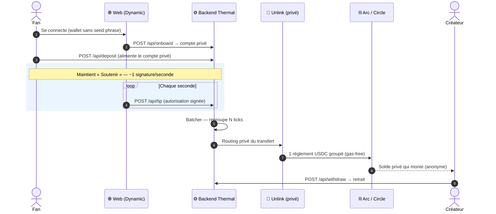
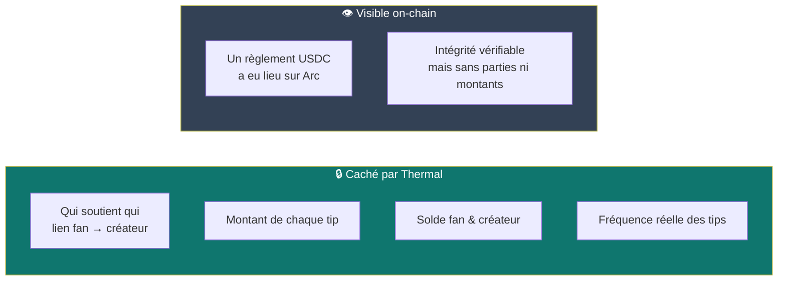

# Thermal

**Réchauffe qui tu veux, seconde après seconde — sans que personne sache que la chaleur vient de toi.**

Thermal permet de soutenir un créateur ou un activiste avec des **nanopaiements à la seconde** en USDC. Le créateur sent la chaleur monter (un total qui grimpe, qu'il peut retirer), mais **personne ne peut voir qui l'a émise** : le lien fan→créateur, les montants et les soldes restent totalement privés. Sur la blockchain, impossible de reconstruire qui soutient qui.

> ETHGlobal New York 2026 · Track **Best Private Nano Payment App** (Dynamic + Unlink + Arc)

---

## En une phrase

Tu maintiens un bouton « Soutenir », ça envoie ~1 micro-paiement par seconde. Thermal les **regroupe** et les **anonymise** avant de les régler sur la blockchain. Le créateur reçoit l'argent ; le radar reste vide.

---

## Pourquoi

Le « pay-per-second » pour créateurs existe déjà (ça a même gagné HackMoney 2026) — **mais à découvert**. Or soutenir un journaliste sous pression, un activiste ou un créateur d'une niche stigmatisée peut être **dangereux** si la transaction est publique. Le vrai actif sensible, ce n'est pas le montant : c'est le **graphe « qui soutient qui »**. Thermal le rend invisible — comme une source de chaleur qu'on détecte sans jamais l'identifier.

---

## Comment ça marche (le parcours complet)



**Lecture rapide :** le fan dépose des fonds une fois, puis « chauffe » le créateur seconde par seconde. Le backend **accumule** ces ticks, les fait passer par **Unlink** (qui casse le lien), et ne règle qu'**un seul paiement groupé** sur Arc. Le créateur voit un total anonyme et retire quand il veut.

---

## Ce qui est privé vs public



- **Le lien fan → créateur** est routé via **Unlink** : la source du fan n'est pas reliable au créateur on-chain.
- **Montants et soldes** passent par des comptes privés Unlink.
- **La temporalité** est brouillée : le **batcher** + le règlement groupé Circle agrègent N ticks en un seul, ce qui casse la corrélation « 1 seconde = 1 paiement ».
- **Ce qui reste public :** qu'un règlement USDC a eu lieu (intégrité). Sur un explorer Arc, **on ne peut pas reconstruire le graphe de soutien.** C'est ça qui gagne le track « private ».

---

## Le rôle de chaque SDK (exigé par le track)

| Outil | Rôle dans Thermal |
|-------|-------------------|
| **Dynamic** | Wallets embarqués **sans seed phrase** (fan & créateur) + signature des autorisations de tip à la seconde |
| **Unlink** | Comptes privés + **routing privé** des transferts (`deposit` / `transfer` / `withdraw`) → masque le lien fan→créateur, les montants et les soldes |
| **Arc (Circle)** | Règlement **gas-free, sub-cent, haute fréquence** des nanopaiements via Circle Nanopayments + Gateway, en USDC |

---

## API (contrat figé — `shared/api.ts`)

| Méthode | Route | Rôle |
|---------|-------|------|
| `POST` | `/api/onboard` | Crée le compte privé du fan depuis son adresse Dynamic |
| `POST` | `/api/deposit` | Alimente le compte privé en USDC |
| `POST` | `/api/tip` | Reçoit une autorisation signée (1 tick) |
| `GET` | `/api/me/spent` | Total dépensé par le fan (`?fanAccountId=`) |
| `GET` | `/api/creator/:id/balance` | Solde anonyme accumulé du créateur |
| `POST` | `/api/withdraw` | Retrait du créateur vers son wallet Dynamic |
| `GET` | `/health` | Probe de santé |

`shared/api.ts` est le **seul point de contact** entre `/server` et `/web` : types, routes et message signé y sont figés. Personne ne change une signature sans prévenir.

---

## Structure du repo

```
thermal/
├── server/         # Backend — Circle Nanopayments + Arc + routing privé Unlink
│   └── src/
│       ├── routes.ts       # endpoints API
│       ├── batcher.ts      # regroupe N ticks en 1 règlement
│       ├── verify.ts       # vérifie les signatures Dynamic
│       ├── ports/          # interfaces circle / unlink
│       └── adapters/       # implémentations mock + réelles
├── web/            # Frontend — Next.js + Dynamic (UX fan & créateur)
├── shared/
│   └── api.ts      # contrat d'API FIGÉ, importé par les deux côtés
├── docs/           # architecture, audit, rapport, setup
└── README.md
```

**Règle de merge :** une branche par dev (`feat/server`, `feat/web`), PR vers `main`. **Personne ne touche le dossier de l'autre.** Seul `shared/api.ts` est partagé.

---

## Démarrage

### Prérequis
- Node 20+
- Clés testnet : Circle (Developer tools / Gateway), config Unlink, RPC Arc testnet, Dynamic App ID

### Backend (`/server`)
```bash
cd server
cp .env.example .env   # remplir clés Circle / Unlink / Arc RPC
npm install
npm run dev            # démarre le serveur (mock d'abord, puis réel)
```
> Les adapters `*.mock.ts` permettent de tourner sans aucune clé : le front n'est jamais bloqué.

### Frontend (`/web`)
```bash
cd web
cp .env.example .env   # remplir NEXT_PUBLIC_DYNAMIC_ENV_ID + NEXT_PUBLIC_API_URL
npm install
npm run dev            # http://localhost:3000
```

---

## La démo (le money-shot)

Split-screen :
1. **Fan** maintient « Soutenir » → le compteur monte à la seconde.
2. **Créateur** voit un **total anonyme** grimper, puis retire.
3. **Explorer Arc** ouvert à côté → **impossible de relier le fan au créateur.**

C'est l'étape 3 qui gagne le prix « private ».

---

## Fallback (si le temps manque)

Si le batching Circle complet ne tient pas : régler par petits lots (voire 1 tick) **mais garder impérativement le routing privé Unlink** — la confidentialité est le cœur du prix, pas le débit.
</content>
</invoke>
